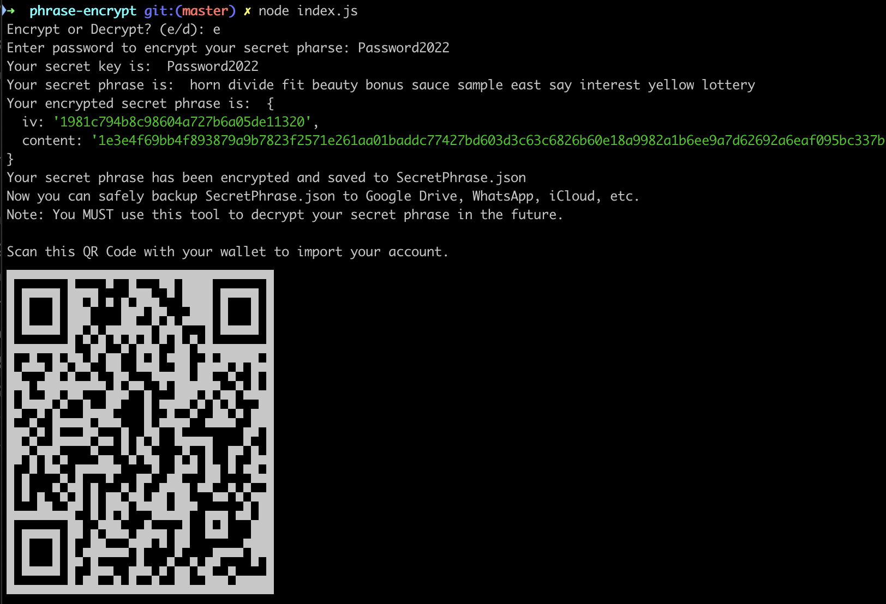
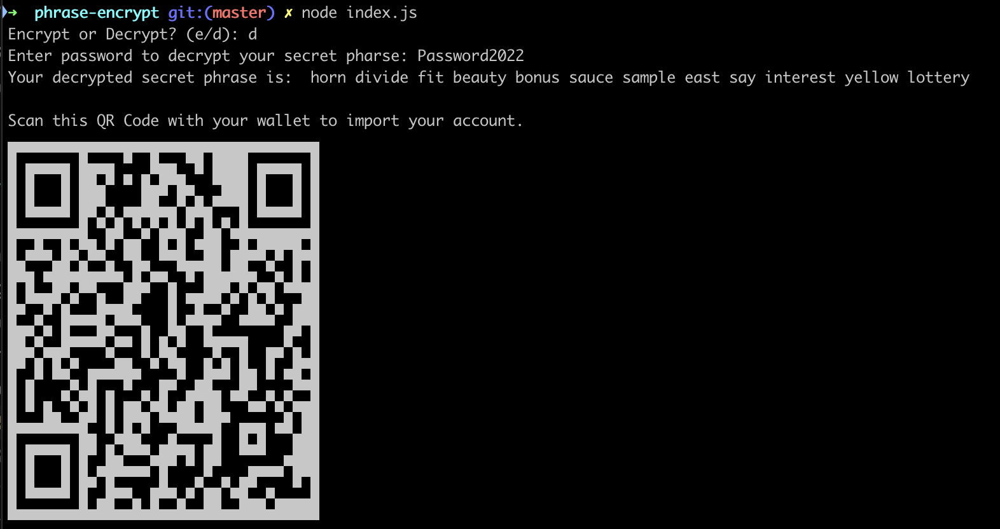

# Simple crypto secret phrase creation and encryption

Naive implementation of a simple crypto secret phrase creation and encryption.

Why?
- Many people store their secret phrase unencrypted in their notes, Google docs, etc.
- Far easier to store a simple JSON file.
- Pieces of paper go missing.

## Requirements

- Node.js 12 or higher (I think. Maybe it works with even older. I don't know.)

## Usage

```bash
$ node index.js
```

Encrypting


Decrypting
